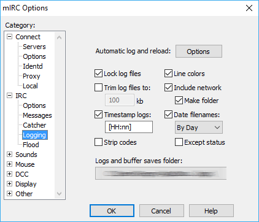

# mirc2html
Create html files from mIRC logs and display them ordered by decreasing dates

### How to install
- Upload the ***mirc2html*** folder on your webserver.
- Upload all your mIRC log files to ***mirc2html*** folder.
- Go to yourdomain.tld/mirc2html

### How to configure mIRC logging
- Keep line colors and don't strip codes, it will be converted in beautifull colors.
- You can customize every colors by modifying the *index.php* colors() function.

